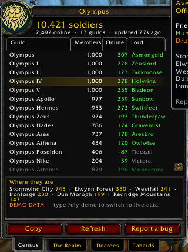

# Olympus

**A live census of every Olympus guild in World of Warcraft: Forever.**
Army size, who leads each guild, where everyone is on the map, royal decrees and the
tabard inspection, in one window that looks and docks like Blizzard's own Guild window.

<p align="center"></p>

> Built for WoW: Forever. Developed and tested on Classic Era (1.15) and Anniversary (2.5).
> The Forever client is expected to behave the same; please report anything that breaks.

## Why

Olympus is not one guild. It is a realm of many guilds, and a guild caps at 1,000 members.
Nobody can see all of them at once in game: you only see the roster of your own guild.
This addon puts them together, so the whole army fits in one place.

## Features

| Tab / place | What you get |
|---|---|
| **Census** | Every Olympus guild in columns (Guild, Members, Online, Lord), sortable like the Guild window. Total soldiers, online, and where the army stands per zone and per continent |
| **The Realm** | The hierarchy: King, the Lord of each guild and their Captains (officers) with level, class and last seen, ranks with head counts, inactive members (7+ and 30+ days), the level race, guilds with free slots, and layers named after the highest ranked member on them |
| **Decrees** | *Call to arms!* (alarm with a map marker), *Muster here* (rally point), *Royal decree* (proclamation). Captains call to arms and muster, the Crown issues royal decrees |
| **Tabards** | Tabard inspection: patrol mode inspects Olympus members near you, marks players or whole guilds, and the Crown can publish the **Wall of Shame** to everyone |
| **Person details** | Click any Lord, Captain or player: level, class, zone, status, with **Whisper**, **Invite** and **Who** buttons |
| **World map** | Olympus soldiers per zone and per continent, toggled from the round Olympus button in the bottom right corner of the map |
| **Guild window** | A round Olympus button in Blizzard's Guild window opens this window glued to its right |
| **Copy** | Every tab can copy a ready-to-paste text for Discord |

Any guild with **"Olympus"** in its name counts (not case sensitive).

## Install

1. Download `Olympus-x.y.z.zip` from [Releases](../../releases).
2. Extract it into `World of Warcraft/<version>/Interface/AddOns/` so you get `.../AddOns/Olympus/Olympus.toc`.
3. Restart the game. If it is marked out of date, tick **Load out of date AddOns**.

Open it with `/oly`, the minimap button, or the round button in your Guild window.
Demo data is on the first time, so you can see everything right away. Type `/oly demo` for live data.

## How it works

- Any guild member can read their own guild's roster: name, level, class, zone and online status.
- So **one member per guild** with the addon is enough for that guild to show up.
- Members with the addon find each other in guild chat (hidden addon messages) and pick
  **one reporter per guild**. Everyone picks the same one, so there is no negotiation.
- The reporter sends a short summary every 2 minutes on a hidden channel (`OlympusNet`).
  Every client adds up all the summaries.
- Nothing leaves the game. There is no server, no account and no tracking. Everything is in this repository.

### Built for a big crowd

- One summary per guild every 2 minutes, not one per player.
- In a full guild, only the members who could be elected keep saying hello. The rest go
  quiet after 10 are known.
- Layers are announced by officers plus a stable 1 in 8 sample, every 10 minutes.
- Decrees are rate limited per sender and in total. Sounds play at most once every 15 seconds.
- The send queue spaces messages 1.2 s apart, below Blizzard's addon message limits.
- Received data is validated and clamped, so a malformed or hostile message is dropped.

## Commands

| Command | |
|---|---|
| `/oly` | open or close the window |
| `/oly realm`, `/oly decrees`, `/oly tabard` | open a tab |
| `/oly patrol` | start or stop the tabard patrol |
| `/oly mark [reason]` | mark your target |
| `/oly arms [text]`, `/oly muster [text]` | decrees (`test` = local preview) |
| `/oly map` | zone counts on the world map |
| `/oly demo` | demo data on or off |
| `/oly sound` | alert sounds on or off |
| `/oly bug` | copyable bug report (errors + diagnostics) |
| `/oly status` | diagnostics in chat |
| `/oly pattern <text>` | which guild names count (`*` = any) |
| `/oly officer <n>` | ranks 1..n count as officers |

## Reporting a bug

Type `/oly bug` (or click **Report a bug**), copy the text and paste it in an issue. Errors
are also saved in `WTF/Account/<ACCOUNT>/SavedVariables/Olympus.lua`.

## Development

```bash
luajit tests/run.lua                      # offline tests (codec, roster, hierarchy, layers, decrees)
scripts/package.sh                        # dist/Olympus-<version>.zip
WOW_HOST=user@pc scripts/deploy.sh        # copy to a Windows PC over SSH
WOW_HOST=user@pc scripts/logs.sh          # read the log and captured errors from that PC
```

Bundled libraries: LibStub (public domain), CallbackHandler-1.0 (Ace3, BSD) and
HereBeDragons by Nevcairiel (BSD), the map library Questie uses.

## License

MIT. Not affiliated with Blizzard Entertainment or the Olympus guild leadership.
