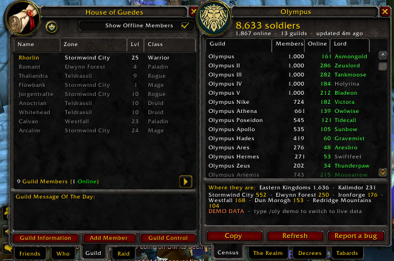
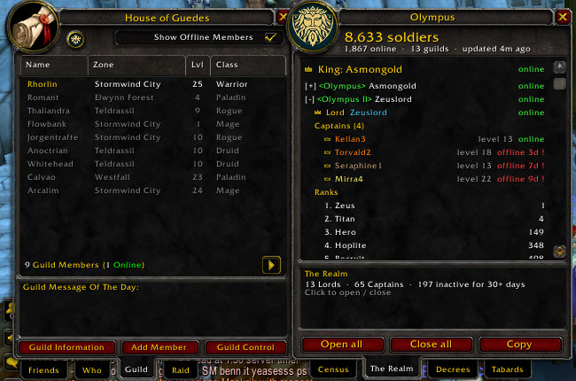
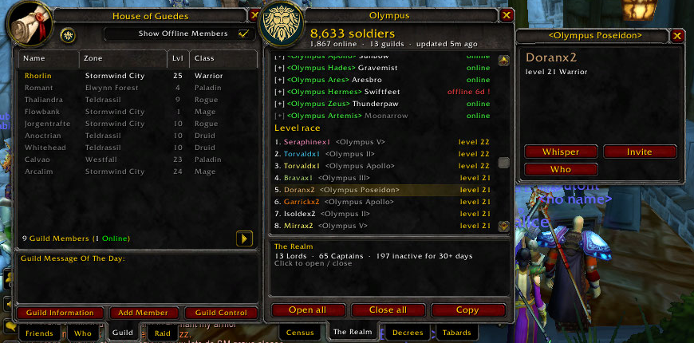
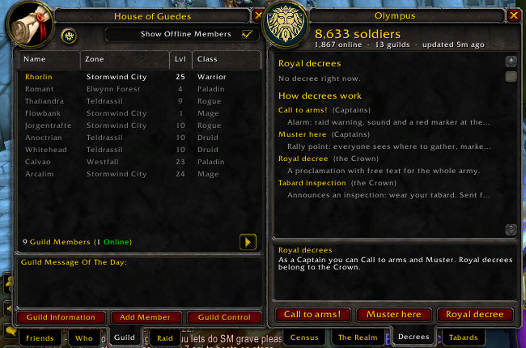
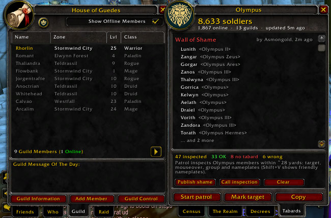

<p align="center"></p>

# Olympus

**The whole Olympus army in one window, inside World of Warcraft: Forever.**

Olympus is Asmongold's guild for *World of Warcraft: Forever*: Alliance, PvP ruleset, a
place to find dungeon groups, organize raids, share class knowledge and build the guild
together. It grew past **10,000 members during the beta**. A WoW guild caps at 1,000
members, so Olympus is really a *realm* of many Olympus guilds. In game each player
only ever sees the roster of their own guild. Nobody could tell how many Olympus guilds
exist, who leads them, or where the army is.

This addon answers exactly that. It adds up every Olympus guild live, in a window that
looks like Blizzard's Guild window and docks right next to it.

<p align="center"></p>

<table>
<tr>
<td></td>
<td></td>
</tr>
<tr>
<td></td>
<td></td>
</tr>
</table>

<sub>Screenshots use the built-in demo data.</sub>

> **Status:** built for WoW: Forever and tested on Classic Era (1.15) and Anniversary (2.5).
> The author has no Forever beta access yet, so please report anything that behaves
> differently there (`/oly bug`).

---

## Who can use it

**Only members of a guild with "Olympus" in its name.** The check is fixed in the code and
cannot be switched off with a command. Outside an Olympus guild the addon joins no channel,
sends nothing and receives nothing. The only thing it offers there is the **Join Olympus**
screen described below. Anyone can still open a
**demo preview** with `/oly demo`, which uses made-up data and connects to nothing.

### Not in Olympus yet?
First it asks the obvious question: *"<Your Guild>? Disband immediately. What are you
doing?"* Then it helps you get in. The **Join Olympus** screen uses the game's own `/who` to
find Olympus members online, groups them by guild, and whispers one of them a ready-made
request that you can edit ("Hi! I'd love to join Olympus. Does <Olympus II> have room for
one more?"). No answer? **Try someone else** picks a member you have not asked yet. Replies
are highlighted. It is rate limited, so nobody gets spammed.

## What it does

### Census: the army at a glance
- Every Olympus guild in one list: **Guild · Members · Online · Lord**. Columns sort by
  clicking, like the Guild window.
- **Total soldiers** and **online now** across the whole realm.
- **Where the army stands**: top zones ("Stormwind City 742") and totals per continent
  (Eastern Kingdoms, Kalimdor).
- Hover a guild: members, online, free slots, average level, inactive members, classes online, top zones.

### The Realm: the hierarchy
- The **King**, then every guild's **Lord** (guild master) and **Captains** (officers).
  Each shows level, class and online or *offline 3d*. Long absences show in red.
- The **ranks** of each guild with how many members hold them.
- **Inactive members**: offline 7+ and 30+ days, per guild.
- **Level race**: the highest level players of the realm.
- **Recruiting**: the guilds that still have free slots, so new players go where there is room.
- **Layers** of your zone, named after the highest ranked Olympus member on each one
  ("Asmongold's layer"), with how many members are there.

### Person details
Click any Lord, Captain, racer or inspected player. You get the same card the Guild window
shows: level, class, zone, rank and status, with **Whisper**, **Invite** and **Who** buttons.
Any soldier can reach the Lord of another Olympus guild in two clicks.

### Decrees
| Decree | Who | What happens |
|---|---|---|
| **Call to arms!** | Captains | Alarm for every Olympus guild: raid warning, sound, red marker at the caller's position for 5 min |
| **Muster here** | Captains | Rally point: horn marker on the map for 30 min, soft alert |
| **Royal decree** | The Crown | A proclamation with free text, as a raid warning to the whole army |
| **Tabard inspection** | The Crown | Announces an inspection at the caller's position: wear your colors |

*The Crown* means the guild masters of Olympus guilds and the officers of the main
`<Olympus>` guild. Everyone else gets a local preview when they press the buttons.

### Tabards: tabard inspection and the Wall of Shame
- **Patrol**: walk through the crowd and the addon inspects nearby Olympus members one by
  one (about 28 yards). It records who wears a tabard, who wears the wrong one and who
  wears none. Players it could not see properly are never accused.
- **Mark** a player (with a note: `/oly mark complained about the rule`) or a whole guild.
- Per guild: *"5 of 20 with problems"*.
- **Wall of Shame**: the Crown publishes the list, and every Olympus member with the addon sees it.
- Hover any player in the world to see their last inspection in the tooltip.

### World map
- Soldiers per zone on zone and continent maps, and per continent on the world map.
- The round **Olympus** button in the bottom right corner of the map switches markers
  (army per zone, decrees) on and off.

### Everywhere
- **Copy**: every tab produces a ready-to-paste text for Discord.
- The window opens from `/oly`, the minimap button, or the round button in your Guild window.
- English and Portuguese (follows the game language).

## Install

**Easiest:** install **Olympus Guild** from the CurseForge app or WowUp. It installs in the
right place and keeps it updated.

**By hand:**
1. Download `Olympus-x.y.z.zip` from **[Releases](../../releases)**.
2. Open your World of Warcraft folder. On Windows it is usually
   `C:\Program Files (x86)\World of Warcraft\`.
3. Open the folder of the game version you play. For the **Forever beta** it is the one with
   *beta* in its name (for example `_classic_beta_`); Classic Era is `_classic_era_`.
4. Go into `Interface\AddOns\` (create `Interface` and `AddOns` if they don't exist) and
   extract the zip there, so you end up with `...\Interface\AddOns\Olympus\Olympus.toc`.
5. **Restart the game.** If the addon list says *out of date*, tick **Load out of date AddOns**.

The addon opens with **live data**. Demo data (made-up guilds, for screenshots) only shows
if you type `/oly demo`, and the window says **DEMO DATA** when it is on.

**One member per guild is enough** for that guild to appear for everyone. The more guilds
have at least one install, the more complete the census gets.

### For officers: seal the channel (recommended)
Type once, with a secret the Olympus officers agree on:
```
/oly key <secret>
```
Your guildmates with the addon receive it automatically through guild chat. From then on
the Olympus channel has a name and password derived from the secret, and outsiders can't
find or join it. Share the same secret with the officers of the other Olympus guilds
(for example in the officers' Discord), so all guilds meet on the same sealed channel.

## How it works

1. Every guild member can read their own guild's roster: name, level, class, zone, rank,
   online and last seen.
2. Members with the addon find each other through hidden addon messages in guild chat and
   **elect one reporter per guild**. The first name alphabetically wins, and every client
   computes the same answer.
3. The reporter sends a compact summary of its guild every 2 minutes on the hidden Olympus channel.
4. Every client adds up all the summaries: that is the census.

Nothing leaves the game. There is no server, no website, no account and no tracking.

**The census is per realm.** Chat channels, including the hidden Olympus one, only exist
inside a realm, so Olympus guilds on different realms (for example ClassicBetaPvP and
ClassicBetaPvP2) can't see each other. The window shows which realm you are counting.

## Security and trust

The addon is plain Lua running on each player's computer, so anyone can edit their own
copy. No addon can prevent that. What this one does is make an edited copy useless:

- **Guild traffic is verified by Blizzard's servers.** Guild addon messages only reach
  members of that guild, so the realm key and guild elections can't be faked from outside.
- **Sender names cannot be forged.** The server stamps every message with its sender.
  - A decree counts only if the sender really is the Lord or a Captain of that guild,
    according to that guild's own roster report, or our own roster for our own guild.
    The rank written inside the message is ignored.
  - A sender can report only one guild.
  - A guild whose reports disagree about its leader or size is flagged, and its ranks are not trusted.
- **Sealed channel** (`/oly key`): outsiders can't find the channel or join it.
- **Validation**: every number is range checked, names are length limited, and malformed
  messages are dropped. Decrees are rate limited per sender and in total.
- `/oly block <name>` ignores a player completely.

Limits, stated honestly: a real Olympus member who edits their copy could still send a
wrong report for **their own** guild. Their guildmates' reports and the conflict flag make
that visible, but it can't be made impossible.

## Built for a crowd of thousands

- One summary per guild every 2 minutes, not one per player.
- In a full guild only the members who could be elected keep saying hello; the rest go quiet.
- Layers are announced by officers plus a stable 1 in 8 sample, every 10 minutes.
- Messages are spaced 1.2 s apart, below Blizzard's addon message limits, and alert sounds
  play at most once every 15 seconds.

## Commands

| Command | |
|---|---|
| `/oly` | open or close the window |
| `/oly realm` · `/oly decrees` · `/oly tabard` | open a tab |
| `/oly patrol` | start or stop the tabard patrol |
| `/oly mark [note]` | mark your target |
| `/oly arms [text]` · `/oly muster [text]` | send a decree (`test` = local preview) |
| `/oly key <secret>` | officers: seal the Olympus channel |
| `/oly block <name>` | ignore a player |
| `/oly map` | zone markers on the world map |
| `/oly demo` | demo data on or off |
| `/oly sound` | alert sounds on or off |
| `/oly bug` | copyable bug report |
| `/oly status` | diagnostics in chat |

## Reporting a bug

Type `/oly bug` (or press **Report a bug**), copy the text and open an issue. Errors are
also saved in `WTF/Account/<ACCOUNT>/SavedVariables/Olympus.lua`.

## Development

```bash
luajit tests/run.lua                      # offline tests: codec, roster, hierarchy, security, layers, decrees
scripts/lint-globals.sh                   # catches locals used before they are declared
scripts/package.sh                        # dist/Olympus-<version>.zip
WOW_HOST=user@pc scripts/deploy.sh        # copy to a Windows PC over SSH
WOW_HOST=user@pc scripts/logs.sh          # read the log and captured errors from that PC
```

Bundled libraries: LibStub (public domain), CallbackHandler-1.0 (Ace3, BSD) and
HereBeDragons by Nevcairiel (BSD), the map library Questie uses.

## License

MIT. A fan project, not affiliated with Blizzard Entertainment, Asmongold or the
Olympus leadership. The Olympus emblem belongs to its owners and is used for the community.

*Sources for the Olympus description: the Olympus Discord welcome message,
[Prism on X](https://x.com/fwprism/status/2101809316382847172) (10K+ members in the beta),
[Dexerto](https://www.dexerto.com/world-of-warcraft/asmongold-responds-as-wow-forever-players-want-him-banned-over-massive-olympus-guild-3411199/).*
